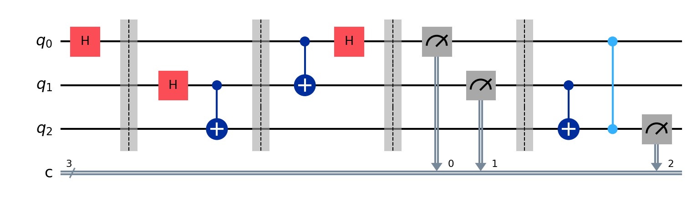

# 🧪 Quantum Teleportation Simulator (Qiskit 2.0.2)

This project simulates **quantum teleportation** using IBM's Qiskit framework. It demonstrates transferring the state of one qubit to another using entanglement, Bell-state measurement, and classical correction.

## 📌 Features

- Implements quantum teleportation using a 3-qubit circuit.
- Uses Qiskit AerSimulator for backend simulation.
- Plots measurement results using `matplotlib`.
- Designed for Qiskit 2.0.2+ with fully updated syntax.

## 🧠 What Is Quantum Teleportation?

Quantum teleportation is a method to transfer a quantum state from one qubit to another without directly moving the physical particle. It uses:
- Entangled qubits (EPR pair)
- Bell measurements
- Classical communication and corrections

## 🛠️ Requirements

Install Python dependencies with:

```bash
pip install -r requirements.txt

## 🧠 Circuit Layout


